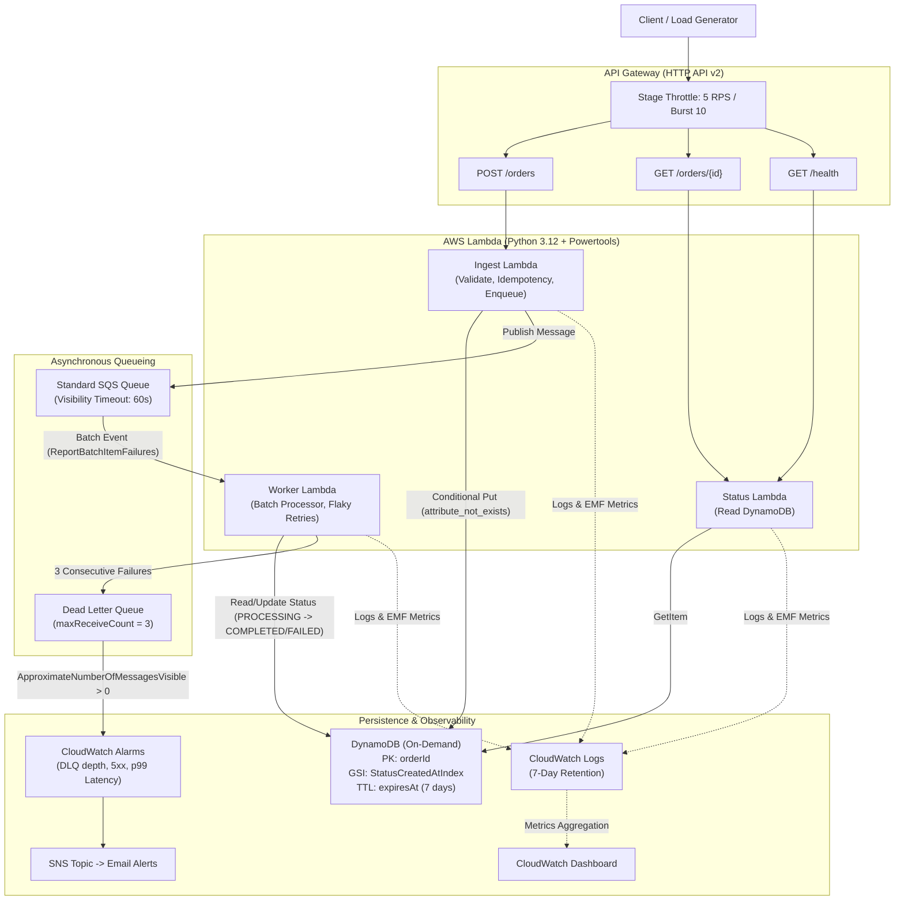

# Order Processing Reliability & Verification Platform

[](https://github.com/Sayyedarham/serverless-order-processing-service/actions/workflows/ci.yml)
[](docs/results/benchmark_summary.md)
[](LICENSE)
[](https://aws.amazon.com)

An event-driven order pipeline with a bounded, token-gated verification runner. Features idempotent ingestion, partial batch failure isolation, DLQ redrive, structured observability, and Terraform deployment. It is a demonstration system: SQS is at-least-once, costs are usage- and account-dependent, and no claim of exactly-once processing, high availability, or guaranteed $0 cost is made.

---

## Architecture Diagram



---

## Key Engineering Highlights

1. **Multi-Layer Idempotency**:
   - Ingestion Layer: Enforces `Idempotency-Key` header with deterministic UUID generation and DynamoDB conditional writes (`attribute_not_exists(orderId)`). Duplicate submissions return HTTP `200 OK` without enqueuing duplicate SQS messages.
   - Worker Layer: Validates order state before calling downstream fulfillment.
2. **Partial Batch Failure Isolation**:
   - Uses `ReportBatchItemFailures` so that single failing messages in a 10-message batch do not force reprocessing of successful messages.
3. **Resilience & Chaos-Tested DLQ Redrive**:
   - Automatically routes messages to a Dead Letter Queue after 3 failed attempts. SQS Redrive tasks programmatically move messages back to the primary queue once downstream dependencies recover.
4. **Cost Safety Limits**:
   - On-demand serverless primitives, bounded API throttling, TTL, log retention, budget alert, and bounded verification runs.
   - Stage-level rate limiting (5 RPS, burst 10) and 10 KB payload size guards prevent runaway bills.
   - $1.00 monthly AWS Budget safety alert configured.
5. **Observability**:
   - Structured JSON logging with AWS Lambda Powertools, distributed correlation IDs (`order_id`, `idempotency_key`), CloudWatch alarms, and operational dashboard.

---

## Reliability verification

`POST /verification/runs` requires `X-Service-Key` and accepts only fixed scenario names. It queues one isolated verification job, persists a seven-day run record, and exposes `GET /verification/runs/{runId}` plus `/results`. The hosted site never includes an application token; the browser BYOK UI keeps one only in memory for the current tab. See [verification guide](docs/verification-guide.md), [failure model](docs/failure-model.md), and [cost safety](docs/cost-safety.md).

## Historical benchmark artifacts

> **Note**: All metrics below represent raw measured numbers from tests executed against the live AWS infrastructure in `us-east-1`. Raw artifacts are located in [`docs/results/`](docs/results/).

| Metric | Measured Value | Target / Baseline | Result |
| :--- | :--- | :--- | :--- |
| **Total Ingest Requests** | **301 requests** | > 300 requests | PASSED |
| **Sustained Throughput** | **4.93 req/s** | 5.00 req/s | PASSED |
| **HTTP Success Rate** | **100.00%** (301 / 301) | > 99.0% | PASSED |
| **Ingest Latency (p50)** | **419.84 ms** | < 500 ms | PASSED |
| **Ingest Latency (p90)** | **514.97 ms** | < 800 ms | PASSED |
| **Ingest Latency (p99)** | **2,030 ms** | < 2,500 ms | PASSED |
| **Unit & Integration Test Coverage** | **94.79%** (28 tests) | >= 85.0% | PASSED |
| **DLQ Chaos Recovery** | **100% (5 / 5 messages redriven)** | 100% | PASSED |
| **Idle Infrastructure Cost** | Historical observation only | Not a guarantee | N/A |

---

## Live Interactive Demo & Documentation

- **Live API Endpoint**: `https://l67j9sjm76.execute-api.us-east-1.amazonaws.com`
- **Interactive Web Demo**: [GitHub Pages Demo](https://sayyedarham.github.io/serverless-order-processing-service/) (`docs/index.html`)
- **System Architecture**: [`docs/architecture.md`](docs/architecture.md)
- **Engineering Design Document**: [`docs/design-doc.md`](docs/design-doc.md)
- **Operational Runbook**: [`docs/runbook.md`](docs/runbook.md)
- **Cost safety**: [`docs/cost-safety.md`](docs/cost-safety.md)
- **Verification guide**: [`docs/verification-guide.md`](docs/verification-guide.md)
- **Architecture Decision Records**: [`docs/adr/`](docs/adr/)

---

## API Reference

### 1. Ingest Order
`POST /orders`

**Headers**:
- `Content-Type: application/json`
- `Idempotency-Key: <unique-uuid-string>`

**Request Body**:
```json
{
  "customer_id": "cust-1029",
  "items": [
    { "item_id": "sku-nvme-1tb", "name": "NVMe M.2 1TB SSD", "quantity": 1, "price": 89.99 },
    { "item_id": "sku-cable-usb", "name": "Braided USB-C Cable", "quantity": 2, "price": 9.50 }
  ]
}
```

**Response (`202 Accepted`)**:
```json
{
  "orderId": "9675cf54-b31d-580b-81cb-9448baa8575b",
  "status": "RECEIVED",
  "message": "Order accepted for processing",
  "createdAt": "2026-10-06T04:35:18Z"
}
```

### 2. Get Order Status
`GET /orders/{orderId}`

**Response (`200 OK`)**:
```json
{
  "order": {
    "orderId": "9675cf54-b31d-580b-81cb-9448baa8575b",
    "status": "COMPLETED",
    "customerId": "cust-1029",
    "totalAmount": 108.99,
    "createdAt": "2026-10-06T04:35:18Z",
    "updatedAt": "2026-10-06T04:35:43.743517+00:00",
    "expiresAt": 1791866118,
    "processedBy": "serverless-orders-worker-prod"
  }
}
```

### 3. Health Check
`GET /health` -> `{"status": "healthy", "service": "order-processing-service"}`

---

## How to Deploy Locally

### Prerequisites
- Python >= 3.12
- Terraform >= 1.7.0
- AWS CLI configured with valid credentials

```bash
# 1. Clone repository
git clone https://github.com/Sayyedarham/serverless-order-processing-service.git
cd serverless-order-processing-service

# 2. Set up Python virtual environment & run tests
python -m venv .venv
.venv\Scripts\activate  # Windows: .venv\Scripts\activate | Linux: source .venv/bin/activate
pip install -e .[dev]
pytest

# 3. Build dependencies layer
pip install -t build/layer/python --platform manylinux2014_x86_64 --only-binary=:all: --python-version 3.12 --implementation cp "pydantic>=2.7.0" "aws-lambda-powertools[all]>=3.0.0"

# 4. Deploy Infrastructure
cd infra
terraform init
terraform apply -var='api_shared_key=<long-random-token>'
```

Before the first deploy, run the one-time [state bootstrap](infra/bootstrap/README.md). It migrates the existing local state to the encrypted shared backend that GitHub Actions uses. Without it, a GitHub runner has no state and will try to recreate existing AWS resources.

---

## How to Tear Down Infrastructure

To completely destroy all provisioned AWS cloud resources and prevent any future costs:

```bash
cd infra
terraform destroy
```

---

## License
MIT License. Copyright (c) 2026 Sayyed Arham Ali.
