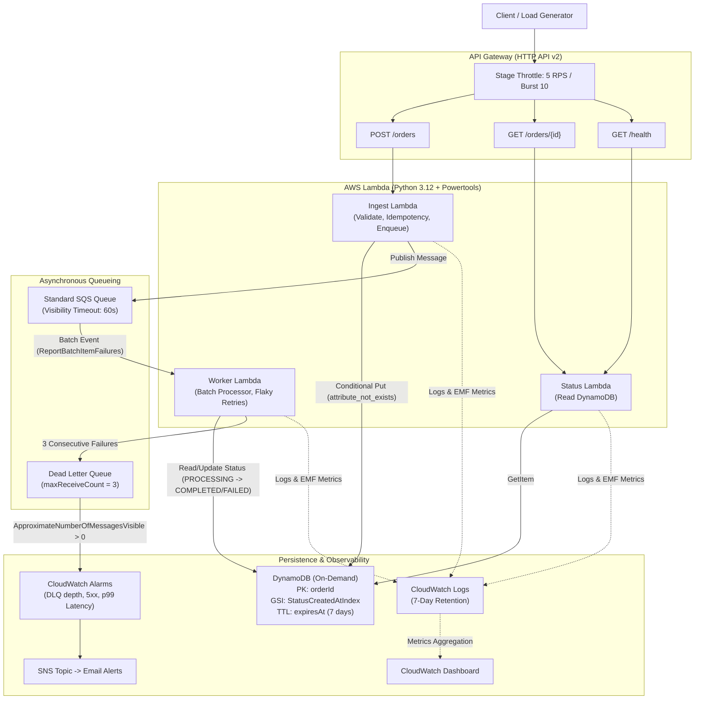

# System Architecture

## Overview
The **Serverless Event-Driven Order Processing Service** is an enterprise-grade, zero-cost portfolio project demonstrating high throughput asynchronous processing, strict idempotency guarantees, fault tolerance, and comprehensive observability.

## Architectural Components

### 1. Ingestion Layer
- **Amazon API Gateway (HTTP API v2)**: Provides low-latency HTTP endpoints with stage-level rate limiting (5 RPS, burst 10) to eliminate runaway costs.
- **Ingest Lambda**:
  - Validates schema using **Pydantic v2**.
  - Enforces mandatory `Idempotency-Key` header and payload size constraints (< 10 KB).
  - Performs conditional write into DynamoDB (`attribute_not_exists(orderId)`).
  - Returns `202 Accepted` on new orders or `200 OK` on duplicate replays.

### 2. Messaging & Decoupling
- **Amazon SQS Standard Queue**: Decouples ingest from background processing, absorbing traffic spikes.
- **Dead Letter Queue (DLQ)**: Configured with `maxReceiveCount = 3` and 14-day retention.
- **Partial Batch Item Failures**: Uses `ReportBatchItemFailures` so only failed individual messages in a batch are returned to SQS for retry.

### 3. Processing Layer
- **Worker Lambda**:
  - Consumes SQS batches (up to 10 records per batch, 5s batching window).
  - Idempotent state check before executing downstream actions.
  - Runs the deterministic fulfillment simulation; failure injection is confined to tests.

### 4. Persistence & Lifecycle
- **Amazon DynamoDB (Pay-Per-Request)**:
  - Primary Key: `orderId` (String UUID).
  - Global Secondary Index: `StatusCreatedAtIndex` (`status` Partition Key, `createdAt` Sort Key).
  - Time-to-Live (TTL): Automatically cleans up orders after 7 days via `expiresAt`.

### 5. Observability & Alerting
- **AWS Lambda Powertools**: Structured JSON logging with correlation IDs (`order_id`, `idempotency_key`, `request_id`).
- **CloudWatch Alarms & SNS**: Immediate email notifications for DLQ message arrival, Lambda errors, API 5xx spikes, and elevated p99 latency.
- **AWS Budgets**: $1.00 monthly spending safety ceiling with email alerts at 80% actual and 100% forecasted spend.
